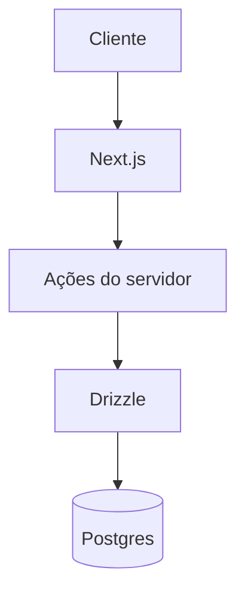

# Arquitectura (diagramas)

> **Projeto Recanto:** Next.js 15 (App Router), React 19, TypeScript, Tailwind, shadcn/ui em `components/ui/`, Drizzle ORM + Postgres Neon (`lib/db/`, `services/`). Referência: `.context/docs/project-overview.md` e `.cursorrules`.
>
> **Adaptação:** em passos genéricos, usar pastas reais do repo: `app/`, `components/`, `lib/`, `services/`, `hooks/` (evitar assumir `src/` ou Vite).

> **Recanto:** diagramas devem reflectir `app/`, `services/`, `lib/db`, Neon — ver também `.context/docs/architecture.md`.

Este workflow ajuda a criar diagramas de arquitectura.

## Limites e cuidados

- Basear-se na estrutura **real** do código
- Diagramas simples e focados
- Notação consistente
- Actualizar quando a arquitectura mudar

## Passos

### 1. Âmbito

- Nível: alto, contentores, componentes internos?
- Foco: fluxo de dados, deploy, segurança?
- Audiência?
- Formato: Mermaid, C4, etc.?

### 2. Analisar o código

- Módulos e serviços principais
- Fluxo de dados
- Dependências externas
- Deploy

### 3. Tipo de diagrama

- Contexto — sistema no ambiente
- Contentores — blocos principais
- Componentes — interior de um bloco
- Sequência — interacções no tempo
- ER — dados relacionais

### 4. Criar (exemplo Mermaid)

### 5. Documentar

- Papel de cada nó
- Decisões e *trade-offs*
- Ligações para docs detalhadas

## Princípios

- Um diagrama não precisa mostrar tudo
- Cores e formas consistentes
- Etiquetas curtas
