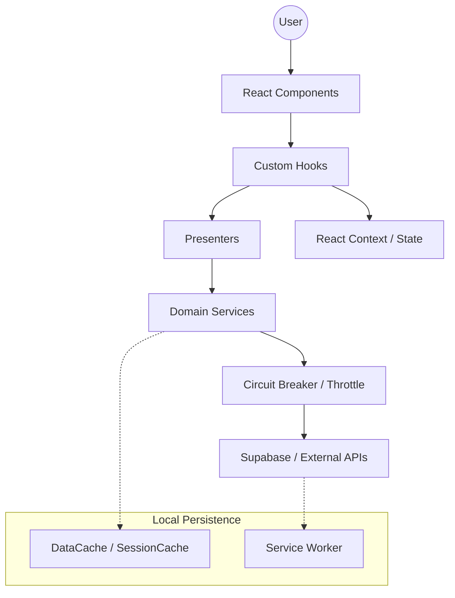

# Architecture Documentation

## Overview

This document provides a comprehensive overview of the system architecture for the HR and vacation management platform. It details the architecture layers, design patterns employed, public APIs, and internal system boundaries, along with key decisions, external service dependencies, and potential risks.

## System Architecture Overview

The architecture adheres to a **Modular Monolith** design, utilizing **Supabase** as a Backend-as-a-Service (BaaS). This structure facilitates real-time updates, robust offline capabilities, and compliance with data protection regulations.

### Build & Runtime

- **Build Tool**: Vite (SPA, NÃO Next.js)
- **Routing**: react-router-dom v6 (BrowserRouter)
- **No SSR**: Purely client-side React application

### Request Flow
1. **User Interfaces**: Interactions through the **Component Layer** (React).
2. **State & Effects**: Managed by **Custom Hooks** and **React Context**.
3. **Presenters**: Control logic, data formatting, and orchestration (1:1 with Models).
4. **Service Layer**: Data access, Supabase calls, and external API integrations.
5. **Resilience Layer**: Circuit Breakers protect from cascading failures.
6. **State Management**: Local state via React Context, persistent state via Supabase.

### Architectural Layers (MVC Adaptada com Presenters)
- **Components**: UI representation (`src/components/`, `src/pages/`)
- **Presenters**: Control logic and data formatting (`src/presenters/`) — 1:1 relationship with Models
- **Services**: Data access and API orchestrations (`src/services/`)
- **Hooks**: React-specific logic (`src/hooks/`, `src/contexts/`)
- **Models & Schemas**: Domain interfaces and type definitions (`src/models/`, `src/schemas/`, `src/types/`)
- **Auth**: Authentication logic and types (`src/auth/`)
- **Utilities**: Cross-cutting concerns (`src/utils/`)
- **Infrastructure**: Supabase configs, migrations, i18n (`src/config/`, `src/supabase/`, `src/i18n/`)

### Detected Design Patterns
| Pattern | Confidence | Locations | Description |
| :--- | :--- | :--- | :--- |
| **Presenter Pattern** | 95% | `src/presenters/` | Separates control logic from UI (1:1 with Models). |
| **Circuit Breaker** | 95% | `src/utils/apiRetryUtils.ts` | Protects from cascading failures. |
| **Service Pattern** | 90% | `src/services/` | Encapsulates domain-specific logic. |
| **Provider Pattern** | 90% | `src/contexts/` | Manages global state and services. |
| **Singleton / Factory** | 80% | `src/utils/supabaseClient.ts` | Ensures single instances of heavy resources. |
| **Observer** | 85% | `src/services/realtimeConnectionService.ts` | Handles real-time data updates. |

### Entry Points
- [src/main.tsx](../../src/main.tsx): Application bootstrap.
- [src/App.tsx](../../src/App.tsx): High-level layout.
- [src/components/Routes.tsx](../../src/components/Routes.tsx): Centralized routing configuration.
- [taskmaster/src/index.ts](../../taskmaster/src/index.ts): Secondary service entry point.

## Public API

| Symbol | Type | Location |
| :--- | :--- | :--- |
| `VacationApiService` | Class | `src/services/vacationApiService.ts` |
| `UserService` | Class | `src/services/userService.ts` |
| `getSupabaseClient` | Function | `src/utils/supabaseClient.ts` |
| `useAuth` | Hook | `src/hooks/useAuth.ts` |
| `ValidationSystem` | Class | `src/utils/validationSystem.ts` |
| `RealtimeConnectionService` | Class | `src/services/realtimeConnectionService.ts` |

## Internal System Boundaries

The system enforces clear boundaries to ensure the integrity and security of data:
- **Auth Boundary**: All secure routes and data retrieval are managed by the `AuthContext`.
- **Admin vs. Employee**: Separate UI components and API services for admin and standard users.
- **Data Validation**: The `ValidationSystem` ensures user inputs are validated before processing.
- **Environment Management**: Configurations are centralized in `src/config/`.

## External Service Dependencies

- **Supabase**: Primary database and real-time data provider.
- **Translation Providers**: Managed through a unified `TranslationManager`.
- **Email Services**: Integrated with Supabase for invitations and notifications.
- **PWA/Service Workers**: For offline capabilities and caching.

## Key Decisions & Trade-offs

- **Service Worker Implementation**: Focused on enhancing availability in offline scenarios.
- **Circuit Breaker Logic**: Prevents UI lockups during API latency issues.
- **Use of BaaS**: Facilitated rapid feature development but demands careful management of client-side logic.

## Risks & Constraints

- **Client Logic Weight**: Increased logic complexity may affect client performance and bundle size.
- **Network Dependency**: Critical features rely on real-time interactions with Supabase.
- **Rate Limiting**: External services may impose limits, managed by `RequestThrottleService`.

## Diagrams

## Additional Resources
- [Project Overview](./project-overview.md)
- [Data Flow](./data-flow.md)
- [Codebase Map](./codebase-map.json)
