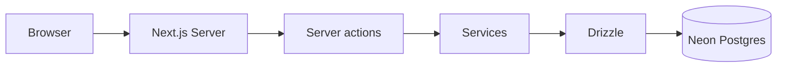

# Fluxo de dados — Recanto

## Resumo

1. **UI** (`app/`, `components/`) dispara acções do utilizador.
2. **Server actions** (`services/*/*.actions.ts`) executam no servidor Next.js.
3. **Serviços** (`services/*/*.service.ts`) chamam o cliente Drizzle.
4. **Drizzle** persiste em **PostgreSQL (Neon)** segundo `lib/db/schema.ts`.

## Leitura vs escrita

- **Leitura:** frequentemente via service + RSC ou fetch no servidor; listagens no dashboard e tabelas.
- **Escrita:** validação na action → serviço → `insert`/`update`/`delete` tipados.

## Importação

- Ficheiros CSV/OFX e utilitários em `lib/` (`parser.ts`, `import-utils.ts`, etc.) alimentam o mesmo modelo `transactions` / `categories` após validação.

## Diagrama

## Ver também

- [architecture.md](./architecture.md)
