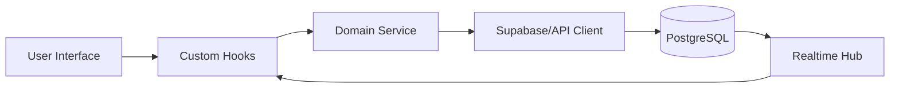

# Data Flow Overview

This document describes the data flow and integration mechanisms within the system, highlighting how data moves through different layers and components.

## Key Concepts

The system is a client-heavy web application that orchestrates data between the user interface, a centralized service layer, and Supabase as the primary persistence and authentication provider.

### Data Entry Points

1. **User Inputs**: Data enters the system via user interactions such as forms, wizards, and calendar inputs.
2. **External Events**: Data can also be triggered from external events through the Supabase Realtime feature.

### Data Handling Process

Data is processed through several domain-specific services that apply business logic (e.g., vacation calculations and GDPR compliance checks) before being persisted or synchronized with external APIs.

### Data Exit Points

Data exits the system through:
- **Persistence**: State updates are pushed to Supabase PostgreSQL via PostgREST.
- **Exports**: Generation of GDPR-compliant data exports.
- **External APIs**: Integration with translation providers (DeepL, Google, Azure) for localized content management.

## Module Dependencies

- **Components** rely on services, hooks, utils, and contexts.
- **Services** utilize utilities, API clients, and types.
- **Hooks** interface with services, utils, and contexts.
- **Pages** use components, services, and hooks.

## Service Layer

The service layer encapsulates business logic and data access, abstracting the underlying infrastructure from UI components.

### Authentication & Identity Services
- **UserService**: Manages user profiles and identity data.
- **UserInviteService**: Handles organization invites.
- **UserActivationService**: Manages account activation.

### Domain Logic Services
- **VacationApiService**: Handles vacation-related requests.
- **VacationRulesCalculator**: Engine for calculating vacation entitlements.
- **LocationService**: Manages Cantons and Municipalities.

### Infrastructure & Compliance Services
- **OfflineDataService**: Facilitates local caching.
- **GdprAuditService**: Logs data privacy compliance.
- **NotificationService**: Manages system alerts.

## High-Level Data Flow

The data flow follows a unidirectional pattern optimized for React:

1. **Input**: Users interact with components (e.g., submit a vacation request).
2. **Validation**: Inputs are checked using `ValidationSystem` and `LocationValidator`.
3. **Processing**: Services process the data (e.g., calculating vacation days).
4. **Communication**: Managed by `CircuitBreaker` and `RequestThrottleService` to ensure reliability.
5. **Synchronization**: Upon success, Supabase Realtime updates subscribed clients.

## Internal Movement

### Collaboration Mechanisms
- **Context API**: Global state is distributed via React contexts.
- **Service Registration**: Utilities manage service health.
- **Event Bus**: Services broadcast updates across components.
- **Caching Layer**: `DataCache` and `SessionCache` minimize redundant network calls.

## External Integrations

### Supabase
- **Purpose**: Authentication, Database, and Realtime subscriptions.
- **Auth**: Managed by `AuthPersistence`.

### Translation Providers
- **Purpose**: Content translations for multilingual support.
- **Strategy**: The `TranslationManager` implements a fallback mechanism for translation providers.

### Service Workers
- **Implementation**: Managed through service worker scripts to enable PWA capabilities.

## Observability & Resilience

- **Circuit Breakers**: Monitor and prevent cascading failures in APIs.
- **Performance Monitoring**: Tracks query execution and component render times.
- **Network Resilience**: Monitors connectivity and adapts operation queues when necessary.
- **Audit Logging**: Ensures compliance by logging movements of sensitive data.

## Related Resources

- For further architectural details, see [architecture.md](./architecture.md).
