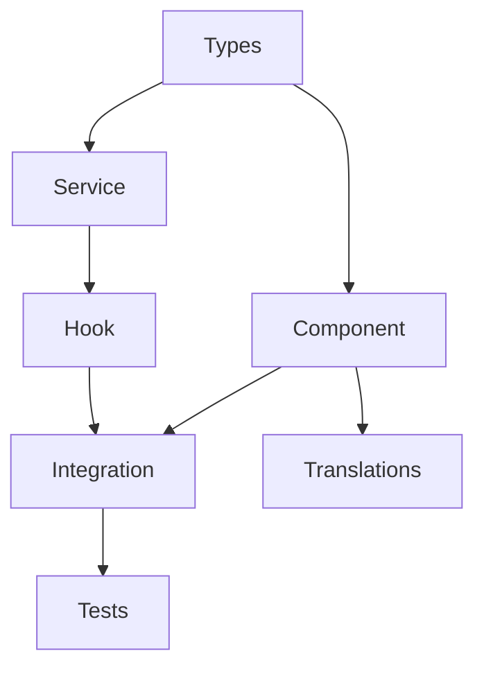

# Feature Breakdown

## When to Use

Activate this skill when:
- Planning a new feature
- Breaking down user stories into tasks
- Estimating work effort
- Creating sprint backlogs
- Defining acceptance criteria

## Feature Breakdown Framework

### Step 1: Understand the Feature

1. **Define the Goal**
   - What problem does this solve?
   - Who benefits from this feature?
   - What is the expected outcome?

2. **Identify User Stories**
   ```
   As a [user role]
   I want to [action]
   So that [benefit]
   ```

3. **Define Acceptance Criteria**
   - What must be true for this to be "done"?
   - Edge cases to handle
   - Performance requirements

### Step 2: Architectural Analysis

1. **Identify Affected Layers**

   | Layer | Questions |
   |-------|-----------|
   | UI | New components? Modify existing? |
   | State | New context? Hooks? |
   | Services | New service? Extend existing? |
   | Data | New tables? Schema changes? |
   | API | New endpoints? RLS policies? |

2. **Check Existing Patterns**
   - Review similar features in codebase
   - Identify reusable components/services
   - Note patterns to follow

### Step 3: Task Decomposition

#### Task Categories

```
1. Foundation Tasks
   ├── Data model/types
   ├── Database schema (if needed)
   └── RLS policies (if needed)

2. Service Layer Tasks
   ├── API service methods
   ├── Business logic
   └── Validation schemas

3. UI Tasks
   ├── Base components
   ├── Form components
   ├── Display components
   └── Integration with state

4. Integration Tasks
   ├── Connect UI to services
   ├── Error handling
   └── Loading states

5. Quality Tasks
   ├── Unit tests
   ├── Integration tests
   ├── i18n translations
   └── Documentation
```

### Step 4: Task Template

```markdown
## Task: [Task Title]

### Description
[What needs to be done]

### Acceptance Criteria
- [ ] [Criterion 1]
- [ ] [Criterion 2]

### Technical Details
- Files to create/modify: [list]
- Dependencies: [task IDs]
- Estimated effort: [S/M/L]

### Implementation Notes
[Any specific guidance]
```

## Example: Vacation Balance Dashboard Feature

### User Story
```
As an employee
I want to see my vacation balance on the dashboard
So that I can plan my time off
```

### Task Breakdown

```markdown
## Task 1: Define Data Types
- Create `VacationBalance` interface in `src/types/vacation.ts`
- Add to `src/models/` if needed
- **Effort**: S

## Task 2: Create Vacation Balance Service
- Add `getBalance()` method to `VacationApiService`
- Include retry logic with `supabaseWithRetry`
- Handle edge cases (new employee, mid-year start)
- **Depends on**: Task 1
- **Effort**: M

## Task 3: Create VacationBalanceCard Component
- Design card UI following design system
- Display: total, used, remaining days
- Include progress indicator
- **Depends on**: Task 1
- **Effort**: M

## Task 4: Create useVacationBalance Hook
- Fetch balance data
- Handle loading/error states
- Cache results appropriately
- **Depends on**: Task 2
- **Effort**: S

## Task 5: Integrate into Dashboard
- Add VacationBalanceCard to dashboard grid
- Connect with useVacationBalance hook
- Add loading skeleton
- **Depends on**: Task 3, Task 4
- **Effort**: S

## Task 6: Add Translations
- Add i18n keys for all text
- Translate to DE, FR, IT
- **Depends on**: Task 3
- **Effort**: S

## Task 7: Write Tests
- Unit tests for service
- Component tests for card
- Integration test for dashboard
- **Depends on**: Task 5
- **Effort**: M
```

## Task Sizing Guidelines

| Size | Effort | Description |
|------|--------|-------------|
| S | 1-2h | Simple, isolated change |
| M | 2-4h | Moderate complexity |
| L | 4-8h | Complex, multiple files |
| XL | 8h+ | Consider breaking down further |

## Dependency Mapping



## Checklist

- [ ] Feature goal is clearly defined
- [ ] User stories capture all use cases
- [ ] Acceptance criteria are specific and testable
- [ ] All layers (UI, service, data) are addressed
- [ ] Tasks follow existing project patterns
- [ ] Dependencies are correctly identified
- [ ] Effort estimates are reasonable
- [ ] Testing tasks are included
- [ ] i18n is considered

## Related Resources

- [Architecture Documentation](../../docs/architecture.md)
- [Feature Developer Agent](../../agents/feature-developer.md)
- [Development Workflow](../../docs/development-workflow.md)
